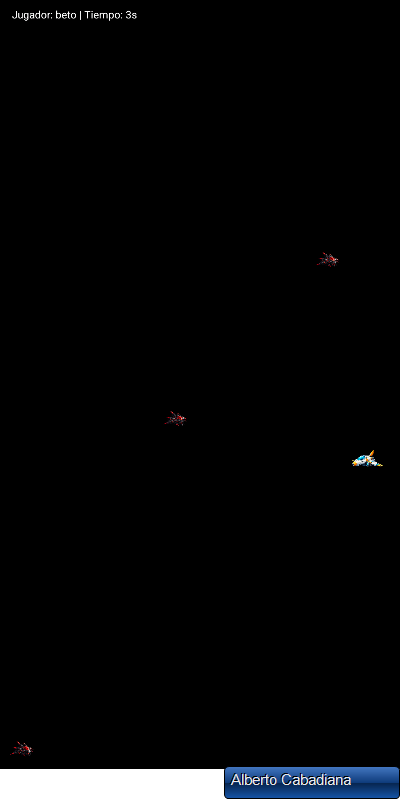
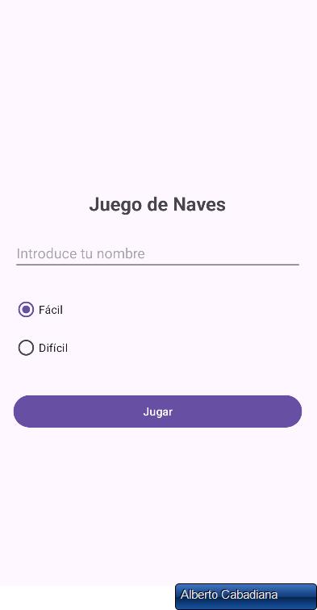
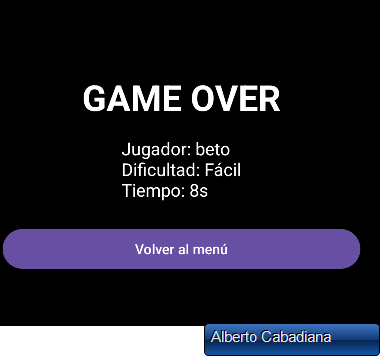

# Juego de Naves 2D — Android 🚀

Videojuego 2D desarrollado como proyecto académico utilizando **Java y Android Studio**.

El jugador controla una nave situada en el lado derecho de la pantalla y debe evitar o destruir las naves enemigas que se desplazan desde el lado izquierdo.

## 🎮 Funcionalidades

- Movimiento vertical de la nave del jugador.
- Generación y movimiento automático de enemigos.
- Detección de colisiones entre objetos.
- Sistema de vidas y puntuación.
- Diferentes niveles de dificultad.
- Menú de inicio y pantalla de fin de partida.
- Pausa y reanudación del juego.
- Música de fondo y efectos de sonido.
- Control de los límites de la pantalla.

## 🛠️ Tecnologías utilizadas

- Java
- Android Studio
- XML
- SurfaceView
- Hilos
- Programación orientada a objetos

## ⚙️ Funcionamiento técnico

El juego utiliza `SurfaceView` para dibujar y actualizar continuamente los elementos gráficos en pantalla.

La lógica principal se ejecuta mediante un hilo independiente que controla el ciclo de juego, el movimiento de los objetos, la detección de colisiones, la puntuación y la actualización de la interfaz.

El proyecto también incluye una clase específica para gestionar la música de fondo y los efectos de sonido durante la partida.

## 📸 Capturas del juego

### Partida en funcionamiento

### Selección de dificultad

### Pantalla de fin de partida

## ▶️ Cómo ejecutar el proyecto

1. Clonar o descargar este repositorio.
2. Abrir el proyecto con Android Studio.
3. Esperar a que Gradle sincronice las dependencias.
4. Seleccionar un emulador o dispositivo Android.
5. Ejecutar la aplicación.

## 📚 Contexto académico

Proyecto desarrollado durante el ciclo de **Desarrollo de Aplicaciones Multiplataforma (DAM)**.

## 👤 Autor

**Alberto Cabadiana**

[LinkedIn](https://www.linkedin.com/in/alberto-cabadiana-b298212a7)
